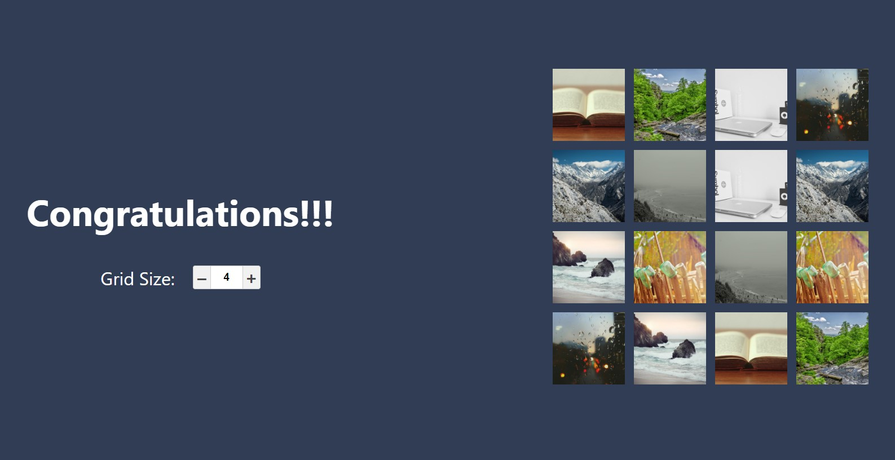

# Memory Game

  
  
    
  

## About this project

Simple Memory Game that enables you to set the grid size.

## Screenshots

### Background

This was initially a nice interview test that I really liked and wanted to push it further.
The product comes without a backend and works with a custom api-client that mocks the requests.

#### The Beggining

The initial project request was to put it into a functional state ignoring ui and style to stay in the timebox,
and lay foundation for the product that emerged (mostly fixing typescript errors, fetching data from the mocked API and applying the game logic).

### Game Requisites

- All the cards should be faced down when the game starts.
- An image is revealed, when the user clicks on a card.
- The user can reveal 2 images at a time.
- If the revealed images are the same they should stay revealed.

### The Next Mile

- Apply unit tests and component tests using Jest.

## Available Scripts

In the project directory, you can run:

### `yarn start`

Runs the app in the development mode. 
Open [http://localhost:3000](http://localhost:3000) to view it in the browser.

The page will reload if you make edits. 
You will also see any lint errors in the console.

### `yarn test`

Launches the test runner in the interactive watch mode. 
See the section about [running tests](https://facebook.github.io/create-react-app/docs/running-tests) for more information.

### `yarn build`

Builds the app for production to the `build` folder. 
It correctly bundles React in production mode and optimizes the build for the best performance.

The build is minified and the filenames include the hashes. 
Your app is ready to be deployed!

See the section about [deployment](https://facebook.github.io/create-react-app/docs/deployment) for more information.

## Learn More

You can learn more in the [Create React App documentation](https://facebook.github.io/create-react-app/docs/getting-started).

To learn React, check out the [React documentation](https://reactjs.org/).

## Live Site

You can check a live demo [here](https://react-memory-game-seven.vercel.app/)

[OnPortfolio](https://front-end-portfolio.vercel.app/)
